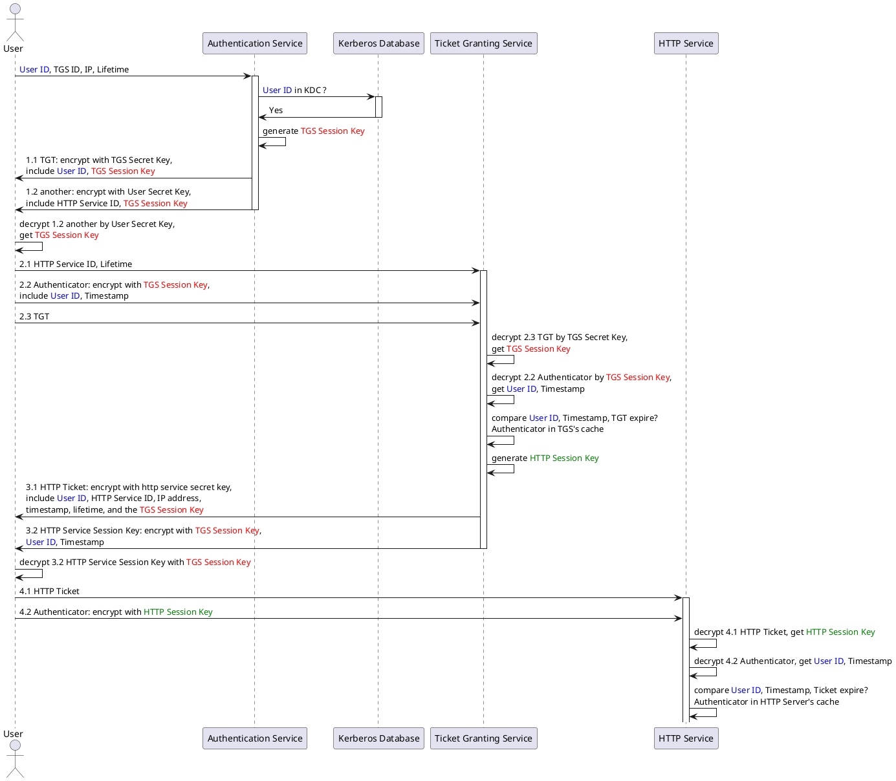

# 5.8 Kerberos

## 基本概念

1. **Key Distribution Center, or KDC**
密钥分发中心，在启用Kerberos的环境中进行身份验证的受信任源。

2. **Kerberos KDC Server**
作为密钥分发中心（KDC）的计算机或服务器。

3. **Kerberos Client**
集群中针对KDC进行身份验证的任何计算机。

4. **KDC Admin Account**
Ambari用于在KDC中创建主体并生成密钥表的管理帐户。

5. **Principal**
    Kerberos principal（又称为主体）用于在kerberos加密系统中标记一个唯一的身份。

6. KDC-**Authentication Service**

    认证服务器。

7. KDC-**Kerberos Database**

    Kerberos 数据库。

8. KDC-**Ticket Granting Service**

    票据授权服务器。

9. **Ticket-Granting Ticket, or TGT**

    票证授予票证.

10. **Fully Qualified Domain Name, or FQDN**

    完全合格域名/全程域名/全限定域名缩写，Fully Qualified Domain Name。既是域名，访问时将由DNS进行解析，得到IP。

    FQDN = Hostname + DomainName

11. **realms name**

    包含 KDC 和许多客户端的 Kerberos 网络，类似于域，俗称为领域。

12. **keytab**

    keytab 是包含 principals 和加密 principal key 的文件。

    keytab 文件对于每个 host 是唯一的，因为 key 中包含 hostname 。keytab 文件用于不需要人工交互和保存纯文本密码，实现到 kerberos 上验证一个主机上的 principal 。

    因为服务器上可以访问 keytab 文件即可以以 principal 的身份通过 kerberos 的认证，所以，keytab 文件应该**被妥善保存，应该只有少数的用户可以访问。**

13. **ticket（票证）**

    ticket 是一种信息包，用于将用户身份安全地传递到服务器或服务。一个票证仅对一台客户机以及某台特定服务器上的一项特殊服务有效。票证包含以下内容：

     - 服务的主体名称
     - 用户的主体名称
     - 用户主机的 IP 地址
     - 时间标记
     - 定义票证生命周期的值
     - 会话密钥的副本

    所有此类数据都使用服务器的服务密钥进行加密。颁发票证之后，可重用票证直到期为止。

14. **credential（凭证）**

    是一种信息包，其中包含票证和匹配的会话密钥。凭证使用发出请求的主体的密钥进行加密。通常，KDC 会生成凭证以响应客户机的票证请求。

15. **authenticator（验证者）**

    是服务器用于验证客户机用户主体的信息。验证者包含用户的主体名称、时间标记和其他数据。与票证不同，验证者只能使用一次，通常在请求访问服务时使用。验证者使用客户机和服务器共享的会话密钥进行加密。通常，客户机会创建验证者，并将其与服务器或服务的票证一同发送，以便向服务器或服务进行验证。

## Principal和Keytab命名约定

|            | 惯例                                           | 示例                                    |
| :--------- | :--------------------------------------------- | --------------------------------------- |
| Principals | $service_component_nam/$FQDN@EXAMPLE.COM       | nn/node1.example.com@EXAMPLE.COM        |
| Keytabs    | $service_component_abbreviation.service.keytab | /etc/security/keytabs/nn.service.keytab |

## 用户访问HTTP服务时序图

## 参考资料

[^1]: [看完您如果还不明白 Kerberos 原理，算我输！](https://cloud.tencent.com/developer/article/1496451)
[^2]:[Explain like I'm 5: Kerberos – roguelynn](https://www.roguelynn.com/words/explain-like-im-5-kerberos/)

