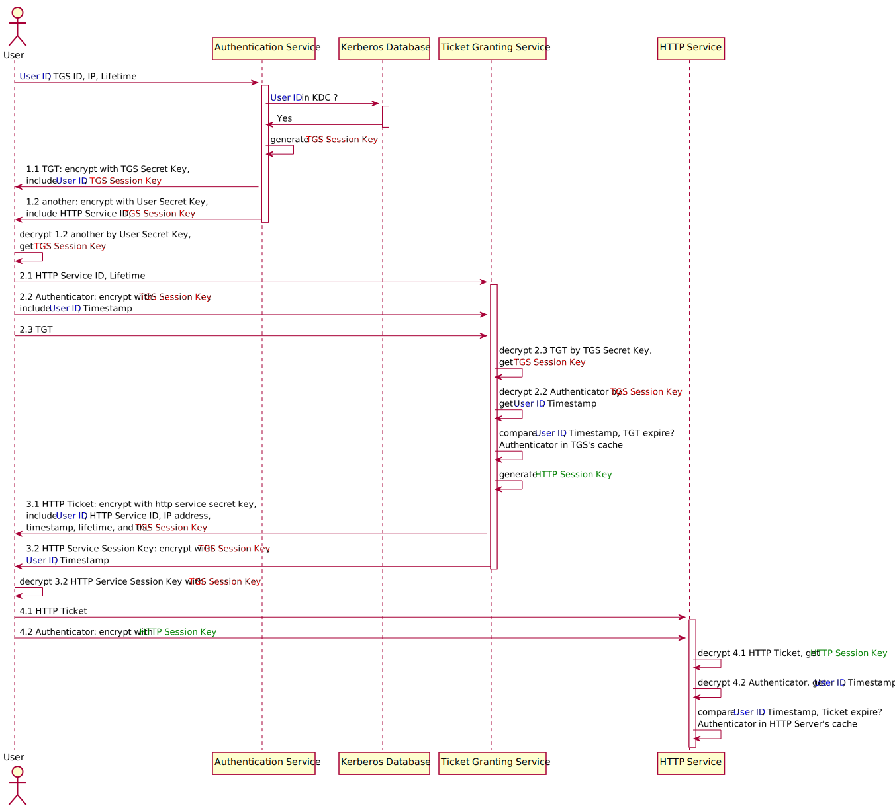
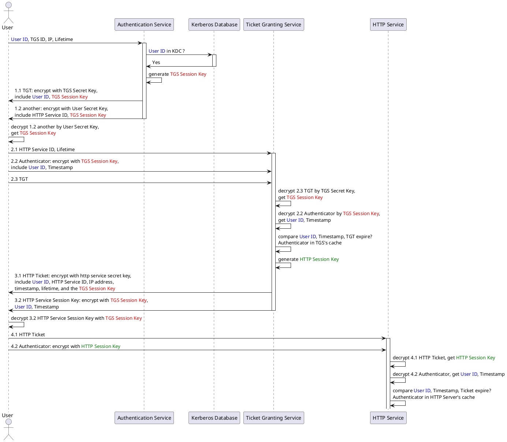

# 5.8 Kerberos

## 用户访问HTTP服务时序图

<!--  -->

```plantuml
@startuml osquery
' hide footbox

'participant "Key Distribution Center" as kdc
actor User as user
participant "Authentication Service" as ats
participant "Kerberos Database" as kd
participant "Ticket Granting Service" as tgs
participant "HTTP Service" as hs


user -> ats : <color:blue>User ID</color>, TGS ID, IP, Lifetime
activate ats
ats -> kd : <color:blue>User ID</color> in KDC ?

activate kd

ats <- kd : Yes
deactivate kd

ats -> ats : generate <color:red>TGS Session Key</color>

user <- ats : 1.1 TGT: encrypt with TGS Secret Key,\ninclude <color:blue>User ID</color>, <color:red>TGS Session Key</color>

user <- ats : 1.2 another: encrypt with User Secret Key,\ninclude HTTP Service ID, <color:red>TGS Session Key</color>

deactivate ats

user -> user : decrypt 1.2 another by User Secret Key,\nget <color:red>TGS Session Key</color>

user -> tgs : 2.1 HTTP Service ID, Lifetime
activate tgs
user -> tgs : 2.2 Authenticator: encrypt with <color:red>TGS Session Key</color>,\ninclude <color:blue>User ID</color>, Timestamp
user -> tgs : 2.3 TGT


tgs -> tgs : decrypt 2.3 TGT by TGS Secret Key,\nget <color:red>TGS Session Key</color>

tgs -> tgs : decrypt 2.2 Authenticator by <color:red>TGS Session Key</color>,\nget <color:blue>User ID</color>, Timestamp


tgs -> tgs : compare <color:blue>User ID</color>, Timestamp, TGT expire?\nAuthenticator in TGS's cache

tgs -> tgs : generate <color:green>HTTP Session Key</color>

tgs -> user : 3.1 HTTP Ticket: encrypt with http service secret key,\ninclude <color:blue>User ID</color>, HTTP Service ID, IP address,\ntimestamp, lifetime, and the <color:red>TGS Session Key</color>

tgs -> user : 3.2 HTTP Service Session Key: encrypt with <color:red>TGS Session Key</color>,\n<color:blue>User ID</color>, Timestamp

deactivate tgs

user -> user : decrypt 3.2 HTTP Service Session Key with <color:red>TGS Session Key</color>

user -> hs : 4.1 HTTP Ticket

activate hs

user -> hs : 4.2 Authenticator: encrypt with <color:green>HTTP Session Key</color>

hs -> hs : decrypt 4.1 HTTP Ticket, get <color:green>HTTP Session Key</color>

hs -> hs : decrypt 4.2 Authenticator, get <color:blue>User ID</color>, Timestamp

hs -> hs : compare <color:blue>User ID</color>, Timestamp, Ticket expire?\nAuthenticator in HTTP Server's cache

' user <- hs : OK

@enduml

```

